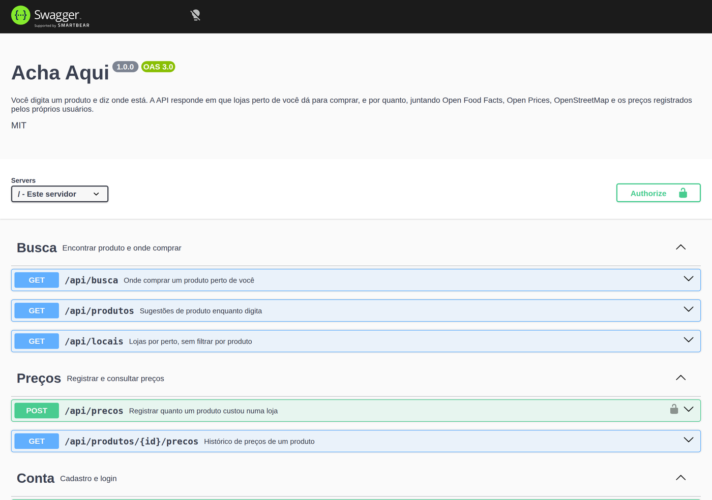

<h1 align="center">Acha Aqui</h1>

<p align="center">
  Você digita um produto, diz onde está, e a API responde em que lojas perto de você dá para comprar.<br>
  <sub>API REST em Node e TypeScript, com Postgres e PostGIS.</sub>
</p>

<p align="center">
  
  
  
  
  
  
</p>



## O problema, e a parte que ninguém conta

A ideia parece simples: busca na internet onde tem o produto. Só que **não existe
API pública e legal que varra a internet atrás de preço**. Google Shopping não
expõe isso. Raspar site de varejista quebra toda semana e vai contra os termos de
uso. A API de busca do Mercado Livre, que seria o caminho óbvio no Brasil, hoje
devolve 403 para quem não é parceiro.

Então o Acha Aqui foi construído em cima do que dá para usar de verdade, de graça
e sem chave:

| Fonte | O que ela responde |
|---|---|
| **Open Food Facts** | Que produto é esse: nome, marca, quantidade, foto, categorias, código de barras. |
| **Open Prices** | Preços já registrados, cada um amarrado a uma loja com coordenada. |
| **OpenStreetMap (Overpass)** | Que lojas existem num raio ao redor de você, e de que tipo cada uma é. |
| **Os próprios usuários** | Quanto custou, em qual loja, em que dia. É o que sustenta a base no Brasil. |

Essa última linha é o ponto. A base do Open Prices é colaborativa e hoje quase
toda europeia, então no Brasil a cobertura é rala. Em vez de fingir que não é
assim, o projeto assume: quem usa também alimenta. A API externa dá o empurrão
inicial, e o que faz a base crescer é gente registrando preço de mercado de
bairro que nem no mapa está.

Tem um segundo buraco, e ele é maior: **o Open Food Facts só conhece comida**.
Bebida, higiene e limpeza também, mas peça de carro, parafuso, ração e caderno
não estão lá, e não existe base aberta equivalente para essas coisas. Procurar
"pastilha de freio" devolveria 404, o que é uma resposta ruim para uma pergunta
razoável.

Só que a pergunta principal não precisa de um catálogo de produtos. "Onde eu
acho isso perto de mim" precisa saber que loja vende o quê, e isso o
OpenStreetMap sabe: cada ponto no mapa carrega uma etiqueta do tipo
`shop=car_parts`. Então a busca tem dois caminhos, e a resposta diz em qual
deles ela veio.

## Como a busca funciona por dentro

`GET /api/busca?q=leite condensado&lat=-19.9227&lon=-43.9451&raio=3000`

1. Procura o produto **primeiro no nosso banco**. Se já conhecemos, a resposta
   sai sem esperar ninguém de fora.
2. Em paralelo pergunta ao Open Food Facts e guarda o que vier. Na próxima busca
   pelo mesmo termo, o passo 1 já resolve.
3. Importa os preços que o Open Prices conhece para aquele código de barras,
   junto com as lojas.
4. Pergunta ao OpenStreetMap que lojas existem no raio. **Quais tipos de loja
   procurar sai das categorias do produto**: remédio puxa farmácia, ração puxa
   petshop, pão puxa padaria.
5. Junta tudo no banco e ordena: lojas com preço primeiro, da mais barata para a
   mais cara, e depois as sem preço, da mais perto para a mais longe.

A resposta traz também um campo `fontes`, dizendo quais integrações responderam
naquela chamada.

### Quando o termo não é comida

`GET /api/busca?q=pastilha de freio&lat=-19.9227&lon=-43.9451`

Aí o passo 1 não acha nada, e em vez de 404 a busca cai para o caminho de
categoria: uma tabela leva o termo digitado ao tipo de comércio que vende
aquilo, e o OpenStreetMap devolve essas lojas no raio. Vem sem foto, sem código
de barras e sem preço, e `resumo.modo` diz `"categoria"` justamente para o
cliente não confundir com o caminho completo.

```jsonc
{
  "produto": null,
  "categoria": { "id": "autopecas", "rotulo": "Auto peças e oficinas" },
  "ondeTem": [
    { "nome": "Auto Peças Central", "tipo": "car_parts", "distanciaTexto": "380 m", "preco": null }
  ],
  "resumo": { "lojasNoRaio": 9, "lojasComPreco": 0, "menorPreco": null, "modo": "categoria" }
}
```

O 404 continua existindo, mas ficou para o que ele deveria ser desde o começo: o
termo não bate com produto **nem** com tipo de loja conhecido.

Tem um detalhe que só apareceu testando. A busca do Open Food Facts é generosa e
tenta achar alguma coisa de qualquer jeito, então procurar "parafuso" podia
voltar com uma bolacha. Aceitar calado faria quem procura parafuso receber
bolacha, que é pior do que receber a ferragem da esquina sem preço. Por isso o
produto que vem de fora passa por um teste de palavra em comum com o termo antes
de ser aceito, e quem não passa cai para a categoria.

```jsonc
{
  "produto": { "nome": "Leite Condensado Moça", "marca": "Nestlé", "quantidade": "395 g" },
  "ondeTem": [
    {
      "nome": "Mercado do Meio",
      "distanciaMetros": 950,
      "distanciaTexto": "950 m",
      "preco": { "valor": 8.49, "moeda": "BRL", "data": "2026-09-10", "origem": "openprices" }
    },
    {
      "nome": "Supermercado Perto",
      "distanciaMetros": 410,
      "distanciaTexto": "410 m",
      "preco": null          // ninguém registrou preço aqui ainda
    }
  ],
  "resumo": { "lojasNoRaio": 14, "lojasComPreco": 3, "menorPreco": 8.49 },
  "fontes": [
    { "nome": "Open Food Facts", "ok": true },
    { "nome": "Open Prices", "ok": true },
    { "nome": "OpenStreetMap", "ok": false, "detalhe": "não respondeu em 6000ms" }
  ]
}
```

Loja sem preço continua na lista de propósito. Ela responde metade da pergunta
("onde provavelmente tem") e é exatamente onde o próximo usuário pode registrar
quanto custou.

## Decisões técnicas

### Depender de três serviços que não são meus

Essa é a decisão que molda o projeto inteiro. Enquanto eu testava, o Open Food
Facts caiu duas vezes. Se cada integração fosse um `await` solto, a API cairia
junto.

Então nenhuma fonte externa pode derrubar a busca. Cada uma roda dentro de um
envelope que, em caso de falha, devolve vazio e anota o problema no campo
`fontes`. O usuário recebe as lojas por perto e um aviso de que o preço não veio,
em vez de um 500.

```ts
const lojas = await tolerante('OpenStreetMap', [], () => overpass.lojasPorPerto(...), fontes);
```

Falha de serviço externo é esperada e some no relatório. Qualquer outro erro é
bug meu e vai para o log com stack trace antes de a busca seguir, senão um
problema de banco ficaria escondido atrás de um "a fonte falhou".

### Cache no Postgres, não em memória

As três APIs são mantidas por projeto aberto e doação. Martelar seria abuso, e
ainda deixaria a resposta lenta. Cada chamada externa passa por um cache com
prazo escolhido pelo tipo de dado: ficha de produto vale uma semana, preço vale
horas, e localização de loja vale um mês (supermercado não muda de lugar).

O cache fica no banco e não em memória porque a aplicação pode rodar em mais de
uma instância e porque, quando ela reinicia, o cache continua lá. E ele tem um
truque: **se a chamada falhar, o cache vencido ainda é servido**. Preço de ontem
é melhor que tela de erro.

### PostGIS, e não uma conta de distância no código

Ordenar por distância parece trabalho de calculadora, mas fazer isso em
JavaScript obrigaria a carregar todas as lojas da tabela para memória a cada
busca.

Com a coluna em `geography` e um índice GiST, o banco resolve:

```sql
where ST_DWithin(l.geom, ponto.g, $3)
order by l.geom <-> ponto.g
```

`ST_DWithin` usa o índice e calcula sobre a esfera, em metros. O `<->` ordena
pela distância aproveitando o mesmo índice. Continua rápido com a tabela grande.

### A ponte entre produto e tipo de loja

O OpenStreetMap não sabe o que é "arroz". Ele sabe que um ponto no mapa é
`shop=supermarket`. Quem faz a ponte é uma tabela que lê as categorias vindas do
Open Food Facts e decide onde procurar:

```ts
{ quando: /medicament|pharmac/, lojas: ['chemist', 'supermarket'] },
{ quando: /pet|cat-food|dog-food/, lojas: ['pet', 'supermarket'] },
```

Consultar o mapa de verdade antes de escrever essa tabela achou um erro que eu
não teria achado sozinho. Num raio de 3 km do centro de Belo Horizonte o
OpenStreetMap tem **65 farmácias como `amenity=pharmacy` e só 4 como
`shop=chemist`**. A consulta original só olhava `shop`, então farmácia estava
praticamente invisível para quem buscasse remédio. Hoje o filtro aceita chave e
valor, e não só `shop`.

### A mesma tabela nos dois lados, sem copiar na mão

A demonstração roda no GitHub Pages, sem servidor, então ela precisa classificar
o termo sozinha no navegador. Duas cópias da mesma tabela é garantia de
divergirem na primeira mudança, então a tabela mora num lugar só, no TypeScript,
e `npm run categorias:web` gera o JSON que a página baixa. Um teste compara os
dois e quebra se alguém esquecer de rodar o gerador.

A função que dá a nota ainda é duplicada, porque uma roda em Node e a outra no
navegador. Aí tem um teste que **arranca a função de dentro do HTML** e cobra
dela a mesma resposta que a API dá, para a mesma lista de termos. Foi ele que
pegou a diferença real: a versão do navegador testava o fim da string com
`indexOf` e aritmética, e o `-1` de "não achei" batia por acaso com a conta
sempre que os dois textos tinham o mesmo tamanho. Na prática, buscar por um
termo sem sentido devolvia uma loja de jardinagem.

### Autenticação escrita à mão

Poderia ter plugado um serviço pronto. Escrevi porque o ponto era mostrar que sei
fazer: senha com bcrypt, token JWT, middleware que separa rota pública de rota
protegida.

Um detalhe que costuma passar batido: no login, e-mail inexistente e senha errada
devolvem **a mesma mensagem**, e a comparação de hash roda mesmo quando o usuário
não existe. Responder diferente, ou responder mais rápido, entrega para um
atacante quais e-mails têm conta aqui.

### Testes contra Postgres de verdade

41 testes de integração, subindo o app inteiro com supertest. O banco é Postgres
com PostGIS mesmo, no CI também: os testes de distância dependem de `ST_DWithin`,
então banco falso não provaria nada.

As APIs externas são simuladas, com um dublê que também sabe **falhar de
propósito**, inclusive falhar só no espelho principal do Overpass para provar
que o segundo é tentado. Tem teste para "o Open Food Facts caiu e o produto já era conhecido",
para "duas fontes caíram e a busca respondeu mesmo assim", e para "a segunda
busca igual não chamou a API de novo".

Escrever os testes pegou dois problemas de verdade: o `npm run build` não
copiava as migrations para `dist/`, então `npm start` quebrava fora do Docker; e
o envelope de tolerância engolia calado qualquer erro, inclusive bug meu de
banco, o que teria escondido o problema atrás de um "a fonte falhou".

## Rodando

Precisa de Docker. É só isto:

```bash
git clone https://github.com/Kauanpfernandes/acha-aqui.git
cd acha-aqui
cp .env.example .env
docker compose up
```

A API sobe em `http://localhost:3000` e a documentação navegável, onde dá para
disparar as chamadas, fica em `http://localhost:3000/docs`. As migrations rodam
sozinhas na subida. Nenhuma das integrações externas pede chave.

Sem Docker, com um Postgres e PostGIS já instalados:

```bash
npm install
npm run migrate
npm run dev
```

Rodar os testes precisa de um banco de teste:

```bash
createdb achaaqui_test
npm test
```

## Estrutura

```
src/
├── config/env.ts           valida as variáveis de ambiente na subida
├── db/
│   ├── pool.ts             conexão, transação e conversão de tipos
│   ├── migrar.ts           roda as migrations pendentes
│   └── migrations/         SQL versionado
├── integracoes/
│   ├── httpExterno.ts      timeout, retry e User-Agent
│   ├── cache.ts            cache com prazo e resgate do cache vencido
│   ├── openFoodFacts.ts    ficha do produto
│   ├── openPrices.ts       preços já conhecidos
│   ├── categorias.ts       do termo digitado ao tipo de loja que vende aquilo
│   └── overpass.ts         lojas por perto no OpenStreetMap
├── modulos/
│   ├── auth/               cadastro, login, JWT
│   ├── busca/              a orquestração das três fontes
│   ├── locais/             lojas e consultas geográficas
│   └── precos/             registro e histórico
├── middlewares/            autenticação e tratamento de erro
└── docs/openapi.ts         especificação servida em /docs

web/                        a demonstração que roda no GitHub Pages
scripts/                    gera o catálogo de categorias da demonstração
tests/                      41 testes de integração
```

## O que eu faria depois

Moderação de preço (hoje qualquer usuário registra qualquer valor), upload da
foto do preço para armazenamento próprio em vez de aceitar URL, e leitura do
código de barras pela câmera. Se um dia valer o custo, dá para plugar os dados
abertos de nota fiscal das SEFAZ estaduais, que é onde mora preço real do varejo
brasileiro.

## Licença

[MIT](LICENSE). Feito por [Kauan Fernandes](https://github.com/Kauanpfernandes).
